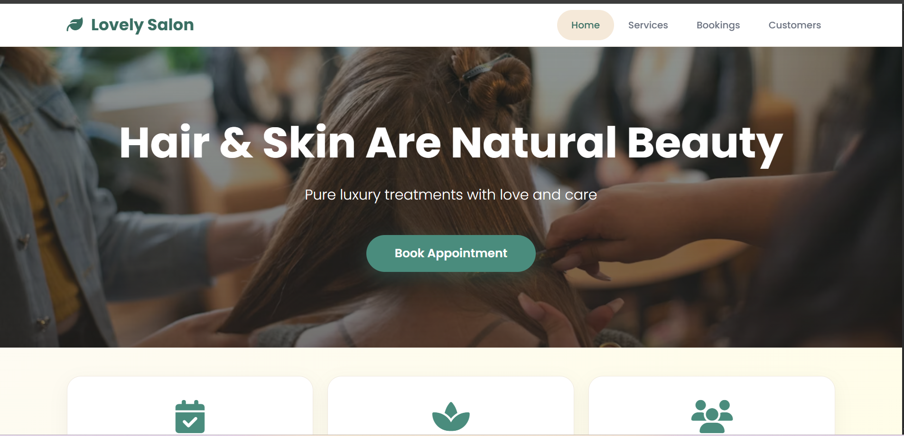

# Salon Booking System - Spring Boot Project

This is a **Salon Booking System** developed using **Spring Boot** with **HTML/CSS frontend**.  
The application allows salon administrators to manage customers, services, and bookings efficiently.  

---

## Features

### 1. Customer Management
- Add, view, edit, and delete customer details.
- Customer fields include:
  - Name
  - Gmail
  - Phone Number
  - Address

### 2. Service Management
- Add, view, edit, and delete salon services.
- Service fields include:
  - Name (Haircut, Facial, etc.)
  - Description
  - Amount
  - Duration

### 3. Booking Management
- Book services for customers.
- Select customer from a dropdown list.
- Select service from a dropdown list.
- Choose booking date and time.
- Manage booking records with CRUD operations.

### 4. User Interface
- Attractive and responsive UI using **HTML and CSS**.
- Simple and intuitive forms for customer, service, and booking management.

---

## Technologies Used

- **Backend:** Spring Boot, Java, Maven  
- **Frontend:** HTML, CSS  
- **Database:** MySQL (using PHPMyAdmin via XAMPP)  
- **Server Port:** 8080  

---

## Installation & Setup

## Follow these steps to run the project locally:

Open in Spring Tool Suite (STS)
Open STS.
Click File → Import → Maven → Existing Maven Projects.
Select the project folder and finish the import.

## Create Database
Open XAMPP and start Apache and MySQL.
Open PHPMyAdmin.
Create a new database named:
salon_booking_db2
Configure Database

## Open application.properties in src/main/resources.
Update database credentials:
spring.datasource.url=jdbc:mysql://localhost:3306/salon_booking_db2
spring.datasource.username=root
spring.datasource.password=
spring.jpa.hibernate.ddl-auto=update
spring.jpa.show-sql=true

## Run the Application

- Right-click the project → Run As → Spring Boot App.
- The server will start at: http://localhost:8080.
- Access the Application
- Open your browser and navigate to http://localhost:8080.
- Use the UI to manage customers, services, and bookings.

## Dependencies

The project uses Maven dependencies such as:

spring-boot-starter-web

spring-boot-starter-data-jpa

mysql-connector-java

spring-boot-devtools (optional for hot reload)

thymeleaf (if used for HTML templates)

git clone https://github.com/your-username/salon-booking.git
cd salon-booking
